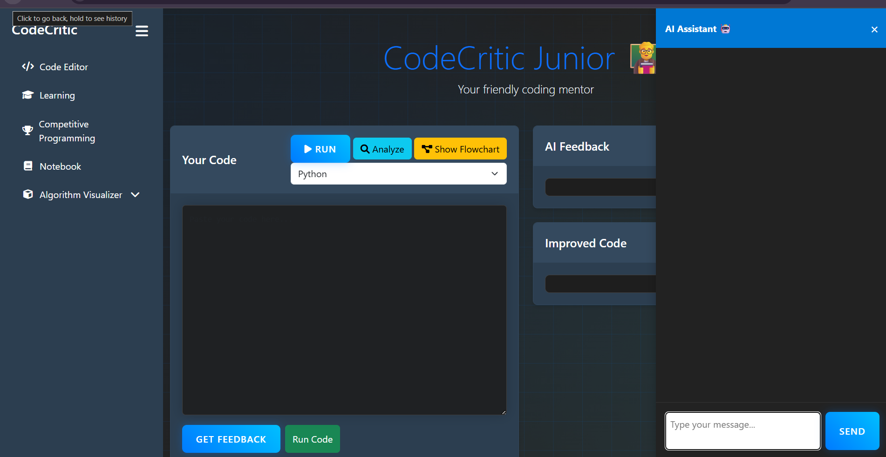

<h1>CodeCritic Junior 🚀</h1>
<p>
  <strong>An AI-powered coach designed to help beginner programmers improve their coding style through real-time, personalized feedback.</strong>
</p>
<p>
<!--   <em>Built for the ACY 2024-25 Experiential Learning project at RV College of Engineering.</em> -->
</p>

---

## 🎯 About The Project

Learning to code is more than just making a program work; it's about writing code that is **clean, efficient, and readable**. However, many beginners struggle with these best practices, often forming bad habits early on.

**CodeCritic Junior** bridges this gap by providing an AI-enhanced educational dashboard that acts as a friendly coding mentor. Our platform analyzes user code in real-time to detect stylistic issues, suggest improvements, and offer interactive learning modules to foster strong programming foundations.

---

## ✨ Key Features

Our platform is packed with features designed to create a comprehensive and engaging learning ecosystem:

* 🧠 **AI-Powered Analysis:** Get instant feedback on code quality, style, and structure. The system detects issues like poor naming, improper indentation, and inefficient logic.
* 🤖 **AI Assistant & Chatbot:** An integrated chatbot offers instant support, answering questions on syntax, DSA concepts, and tool usage.
* 🔮 **AR/VR Algorithm Visualizer:** Interact with data structures and algorithms in an immersive 3D environment to make abstract concepts tangible and easier to understand.
* 📚 **Interactive Learning Center:** Access tutorials and examples on core programming concepts across multiple languages.
* 💻 **Competitive Coding:** Practice and improve problem-solving skills with a curated set of coding problems.
* 📓 **Built-in Notebook:** Save code snippets, track different versions of your solutions, and keep learning notes organized.
* 📊 **Complexity Analysis:** See the real-time **Time & Space Complexity** metrics for your algorithms.
* 🌊 **Visual Flowchart:** Generate an interactive flowchart to understand the execution flow of your code.

---

## 📸 Snapshots 
Here’s a glimpse of the CodeCritic Junior platform in action.


<p><em>The main dashboard with AI Assistant integration.</em></p>
<br>

<p><em>Interactive Learning Center with multi-language support.</em></p>
<br>

<p><em>Competitive Coding section to practice problem-solving.</em></p>
<br>

<p><em>Step-by-step Bubble Sort visualizer.</em></p>

---

## 🛠️ Tech Stack

CodeCritic Junior is built with a modern and robust technology stack to ensure a seamless and scalable experience:

| Category | Technologies |
| :--- | :--- |
| **🤖 AI & ML** | OpenAI Models, Custom Fine-Tuned Models |
| **⚙️ Backend** |  |
| **🎨 Frontend** |    (Also uses React concepts) |
| **🗃️ Database** |  |
| **🔮 AR/VR** | WebXR, Three.js |
| **🚀 Deployment & Tools** | VS Code, Jupyter Notebook, GitHub, Canva |

---

## 🔧 Getting Started

To get a local copy up and running, follow these simple steps.

### Prerequisites

Make sure you have Python and Node.js installed on your machine.

### Installation

1.  **Clone the repo**
    ```sh
    git clone [https://github.com/your_username/CodeCritic-Junior.git](https://github.com/your_username/CodeCritic-Junior.git)
    ```
2.  **Navigate to the project directory**
    ```sh
    cd CodeCritic-Junior
    ```
3.  **Install backend dependencies (Flask)**
    ```sh
    pip install -r requirements.txt
    ```
4.  **Install frontend dependencies (if you have a separate frontend folder)**
    ```sh
    cd frontend
    npm install
    ```
5.  **Run the application**
    ```sh
    # Start the Flask backend
    python app.py
    
    # Start the frontend development server
    npm start
    ```

---

## 👥 Team Members

This project was developed by a dedicated team of students from RV College of Engineering:

| Name | USN | Program |
| :--- | :--- | :--- |
| Mohammed Faid | 1RV22IS403 | ISE |
| MK Heera | 1RV23IS404 | ISE |
| Gagan gowda V S | 1RV23AI400 | AIML |
| Ved M Revankar | 1RV23CS419 | CS |
| Tejas Ganesh Hegde | 1RV22CS219 | CS |

